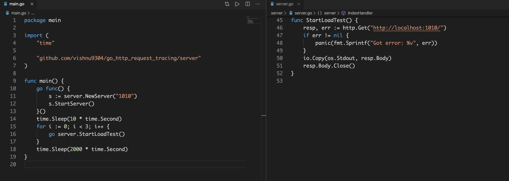
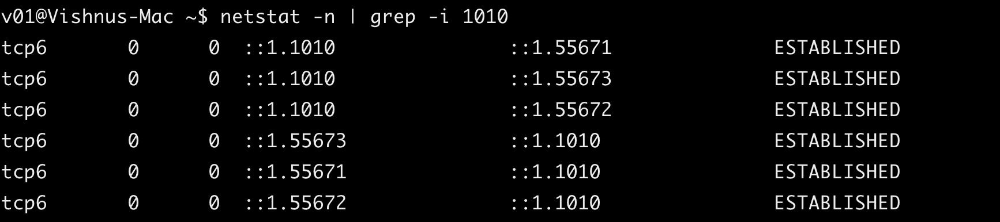
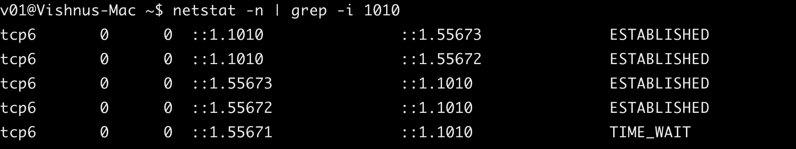

#### Golang HTTP Tracing

#### Key Terms

##### Throughput (Requests Per Second) vs. Concurrent Users

- **Throughput** is a measure of how many units of work are being processed. In the case of load testing, this is usually hits per second, also known as requests per second.

- **Concurrent users** are the number of users engaged with the app or site at a given time. They’re all in the middle of some kind of session, but they are all doing different things.

##### TCP Connection States

- 3-Way Hand Shake

  - **Step 1 (SYN)** - In the first step, client wants to establish a connection with server, so it sends a segment with SYN(Synchronize Sequence Number) which informs server that client is likely to start communication and with what sequence number it starts segments with.

  - **Step 2 (SYN + ACK)** - Server responds to the client request with SYN-ACK signal bits set. Acknowledgement(ACK) signifies the response of segment it received and SYN signifies with what sequence number it is likely to start the segments with.

  - **Step 3 (ACK)** - In the final part client acknowledges the response of server and they both establish a reliable connection with which they will start the actual data transfer.

- 4-Way Disconnect

  - **Step 1 (FIN From Client)** – Suppose that the client application decides it wants to close the connection. (Note that the server could also choose to close the connection). This causes the client send a TCP segment with the FIN bit set to 1 to server and to enter the FIN_WAIT_1 state. While in the FIN_WAIT_1 state, the client waits for a TCP segment from the server with an acknowledgment (ACK).

  - **Step 2 (ACK From Server)** – When Server received FIN bit segment from Sender (Client), Server Immediately send acknowledgement (ACK) segment to the Sender (Client).

  - **Step 3 (Client waiting)** – While in the FIN_WAIT_1 state, the client waits for a TCP segment from the server with an acknowledgment. When it receives this segment, the client enters the FIN_WAIT_2 state. While in the FIN_WAIT_2 state, the client waits for another segment from the server with the FIN bit set to 1.

  - **Step 4 (FIN from Server)** – Server sends FIN bit segment to the Sender(Client) after some time when Server send the ACK segment (because of some closing process in the Server).

  - **Step 5 (ACK from Client)** – When Client receive FIN bit segment from the Server, the client acknowledges the server’s segment and enters the TIME_WAIT state. The TIME_WAIT state lets the client resend the final acknowledgment in case the ACK is lost.The time spent by client in the TIME_WAIT state is depend on their implementation, but their typical values are 30 seconds, 1 minute, and 2 minutes. After the wait, the connection formally closes and all resources on the client side (including port numbers and buffer data) are released.
  
##### Golang HTTP Client Connection Pooling

  - By default, the Golang HTTP client will do connection pooling.

  - Rather than closing a socket connection after an HTTP request, it will add it to an idle connection pool, and if you try to make another HTTP request before the idle connection timeout (90 seconds by default), then it will re-use that existing connection rather than creating a new one.
  
  ```go
  var DefaultTransport RoundTripper = &Transport{
  MaxIdleConns:          100,
  IdleConnTimeout:       90 * time.Second,
  }

  // DefaultMaxIdleConnsPerHost is the default value of Transport's
  // MaxIdleConnsPerHost.
  const DefaultMaxIdleConnsPerHost = 2
  ```
  - The MaxIdleConns: 100 setting sets the size of the connection pool to 100 connections, but with one major caveat: this is on a per-host basis. See the comments on the DefaultMaxIdleConnsPerHost below for more details on the implications of this.

  - The IdleConnTimeout is set to 90 seconds, meaning that after a connection stays in the pool and is unused for 90 seconds, it will be removed from the pool and closed.

  - The DefaultMaxIdleConnsPerHost = 2 setting below it. What this means is that even though the entire connection pool is set to 100, there is a per-host cap of only 2 connections!



- I have opened 3 concurrent http requests. What happens here is it will open 3 tcp connections and after getting the response. It will keep 2 of them open for 90s `IdleConnTimeout says 90s`

- Within 90s if you make any new request the same TCP connection will be used instead of opening new one.

- Client opened 3 TCP connections to the server and they are all in `ESTABLISHED` state.



- Once the request is served two connections are still in `ESTABLISHED` the other one is in `TIME_WAIT` because we have `DefaultMaxIdleConnsPerHost = 2`.

